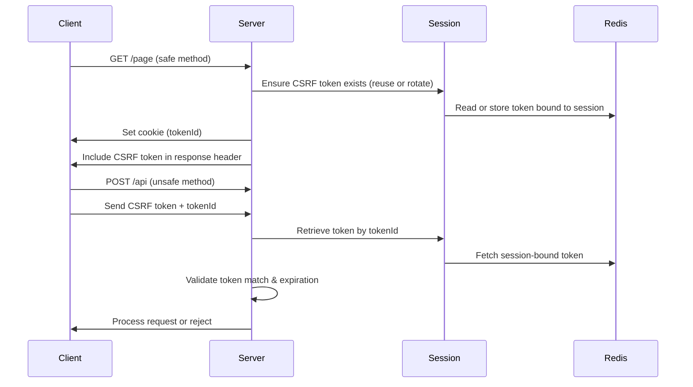

# 🛡️ CSRF Protection Implementation

> Custom token-based CSRF protection middleware for Express.js applications.

---

## 📋 Overview

This implementation provides comprehensive CSRF (Cross-Site Request Forgery) protection without relying on external libraries. It demonstrates a deep understanding of web security principles and session management.

---

## 🏗️ Architecture

### **Token Generation Flow**



---

## 🔑 Key Features

### 1. **Hybrid CSRF pattern (Double-submit + Server-bound token)**

- Token sent in both cookie and header/body
- Prevents attackers from reading tokens via CSRF
- Cookie containing the client token is readable by JavaScript (not HttpOnly); the token ID cookie is HttpOnly (server-readable only)

### 2. **Token Rotation**

- Automatic token generation on safe requests (GET, HEAD, OPTIONS)
- Token invalidation after use (optional single-use mode)
- Expiration after 15 minutes of inactivity

### 3. **Brute-Force Protection**

- Tracks failed CSRF validation attempts
- Rate limiting after 5 failed attempts in 5 minutes
- Per-session attack tracking

### 4. **Session Binding**

- Tokens tied to server-side session
- Redis-backed storage (survives server restart)
- Multiple token support (up to 10 per session)

---

## 🛠️ Implementation Details

### **Token Structure**

```javascript
{
  tokenId: "unique-identifier",    // Sent to client
  token: "cryptographic-random",   // Stored server-side
  hash: "HMAC-SHA256(token)",      // Prevents tampering
  expires: timestamp,              // 15-minute TTL
  createdAt: timestamp            // For tracking
}
```

### **Validation Process**

```javascript
1. Extract tokenId from cookie/header  // Extract tokenId from HttpOnly cookie or header
2. Retrieve stored tokens from session // Retrieve stored tokens from Redis-backed session
3. Find matching token by tokenId // Locate token record
4. Check expiration // Validate token is not expired
5. Compare submitted token with stored hash (timing-safe) // Use timing-safe comparison
6. Optionally delete token (single-use) // Invalidate token if single-use mode is enabled
7. Track failed attempts // Increment failure count on invalid attempts
```

### **Configuration Options**

```javascript
{
  tokenBytes: 32,              // Token size (256 bits)
  maxTokensPerSession: 10,     // Limit stored tokens
  tokenExpirationMs: 900000,   // 15 minutes
  safeMethods: ['GET', 'HEAD', 'OPTIONS'],
  singleUse: false,            // Token invalidation after use
  maxCsrfAttempts: 5,          // Failed attempt threshold
  csrfAttemptWindow: 300000    // 5-minute window
}
```

---

## 🔐 Security Considerations

### **Why Custom Implementation?**

1. **Learning Value**: Deep understanding of CSRF mechanisms
2. **Control**: Fine-grained customization for specific needs
3. **No Dependencies**: Reduced attack surface
4. **Production-Ready**: Includes all best practices

### **Security Features**

✅ **Cryptographically Secure Random**: Uses `crypto.randomBytes()`  
✅ **Timing-Safe Comparison**: Prevents timing attacks with `crypto.timingSafeEqual()`  
✅ **HMAC Signing**: Token integrity verification with HMAC-SHA256  
✅ **HttpOnly Cookies**: Prevents XSS token theft  
✅ **SameSite Attribute**: Additional CSRF protection layer  
✅ **Token Expiration**: Time-based invalidation  
✅ **Rate Limiting**: Brute-force attack mitigation

### **Cookies, SameSite & Secure**

Be explicit about cookie attributes in production. This implementation uses `SameSite: 'Lax'` for the CSRF cookies by default, while the session cookie in `app.mjs` may use `SameSite: 'None'` in production to allow cross-site requests with credentials. Document and unify this choice depending on your deployment:

- If your front-end and API are same-origin, prefer `SameSite: 'Lax'` (or `Strict`) + `Secure: true` in production.
- If you must support cross-site requests with credentials (third-party origins), set the session cookie to `SameSite: 'None'` and `Secure: true` (required by browsers).
- Always pair `SameSite: 'None'` with `Secure: true` and restrict `Domain`/`Path` where possible.

Also document client-side requirements: when relying on cookies for auth or CSRF token delivery, API requests must include credentials, e.g. `fetch(..., { credentials: 'include' })`.

### **CSRF Secret (production)**

## 🔍 Patterns and terminology

`CSRF_SECRET` falls back to a process-random secret when `CSRF_SECRET_KEY` is not provided. In production, **always** set `CSRF_SECRET_KEY` (via env var) to a stable secret so tokens survive process restarts and deployments; otherwise tokens will be invalidated after a server restart.

### Threats addressed

- Cross-site form submissions
- Token replay
- Session fixation
- Brute-force token guessing

### Out of scope

- XSS (must be mitigated separately)

### Comparison with `csurf` / frameworks

- **What `csurf` typically does:** server-side synchronizer-token pattern (stores token in session), validates token on unsafe requests; minimal rotation and no built-in rate-limiting or multi-token session support.
- **What this implementation does differently:** hybrid double-submit + server-bound design with HMAC integrity, token rotation, optional single-use tokens, Redis-backed session storage (survives restarts), per-session brute-force tracking/rate-limiting, and multiple simultaneous tokens per session for improved UX.

---

## 🔍 Patterns and terminology

### Double-submit cookie vs Synchronizer token

- **Double-submit cookie**: The client token is stored in a cookie accessible by JavaScript (not `HttpOnly`) and is also sent in a header/body by the application. The server validates that the header token matches the cookie. This pattern is simple and works well when the cookie is not protected by `HttpOnly` and the application can read it from JavaScript.
- **Synchronizer token (server-bound)**: The server generates and stores the token (or its hash) in the session; the cookie may contain only an `HttpOnly` `tokenId` that identifies the server-side token. The real token is injected into the HTML page or sent in a secure header for JS to use. This pattern is more robust against XSS when combined with HttpOnly cookies for the identifier.

This project uses a deliberate mix: the cookie containing the client token is accessible by JavaScript (not HttpOnly), and the cookie with the tokenId is HttpOnly (server-readable only). Clearly document this choice and do not mix examples that assume both properties for the same cookie.

### Why use HMAC + server-side storage?

- HMAC provides integrity: the server can verify that the presented token was not tampered with without knowing the original token.
- In this design, the server (Redis/session) stores the HMAC `hash` of the token along with `tokenId`, `expires`, and `createdAt`. The client sends the `token`; the server applies HMAC with `CSRF_SECRET` and compares (timing-safe) with the stored `hash`.

---

## 🌐 APIs, CORS and cookies

- If your authentication uses the `Authorization` header (bearer tokens), the CSRF attack surface is reduced because an attacker cannot automatically read the token from the victim's browser. CSRF primarily affects cookie-based authentication.
- For cookie-based APIs: configuring CORS correctly is critical. Recommendations:
  - Limit `Access-Control-Allow-Origin` to trusted origins.
  - Enable `Access-Control-Allow-Credentials: true` on the server and use `fetch(..., { credentials: 'include' })` on the client.
  - Avoid `'*'` as `Allow-Origin` when `credentials` is enabled.

---

## 🔐 HttpOnly vs Expose token in header (safe pattern)

- For maximum protection against XSS, store the identifier token (`tokenId`) in the `HttpOnly` cookie and send the actual token in a response header (`X-CSRF-Token`) only when it is generated. The client reads the header and stores it in memory (not in a cookie) for the next request. This way, even if an XSS attacker reads cookies, they will not be able to obtain the token unless it is written to a cookie.

- If you adopt this pattern, document the rotation: issue the token on every safe request and, if `singleUse` is true, invalidate it after use.

---

## 🔁 Token reuse / Single-use: trade-offs

- **Single-use**: increases security against replays but complicates UX (form resubmits, back navigations). Recommended for non-idempotent endpoints.
- **Multi-use with short expiration**: better UX, less friction. Keep expirations short (e.g., 15 min) and limit tokens per session.
- To prevent replays on critical endpoints, combine `single-use` with idempotency/nonce checks at the application level.

---

## 🧩 Practical Examples

### Example `Set-Cookie` with attributes

```
Set-Cookie: XSRF-TOKEN=<token>; Max-Age=900; Path=/; Secure; SameSite=Lax
Set-Cookie: XSRF-TOKEN-ID=<tokenId>; Max-Age=900; Path=/; HttpOnly; Secure; SameSite=Lax
```

### Example `fetch` with `credentials`

```javascript
// When relying on cookies for session/auth
fetch('/api/data', {
  method: 'POST',
  credentials: 'include', // send cookies
  headers: {
    'Content-Type': 'application/json',
    'X-CSRF-Token': getCookieValue('XSRF-TOKEN'),
    'X-CSRF-Token-ID': getCookieValue('XSRF-TOKEN-ID'),
  },
  body: JSON.stringify(data),
});
```

Note: if you use the `HttpOnly tokenId` + header token pattern, the client must read the token from the header emitted by the server and not from the cookie.

---

## 📊 Code Example (Simplified)

```javascript
// Token Generation
function generateToken() {
  const tokenId = crypto.randomBytes(32).toString('hex');
  const token = crypto.randomBytes(32).toString('hex');
  const hash = crypto
    .createHmac('sha256', CSRF_SECRET)
    .update(token)
    .digest('hex');

  return {
    tokenId,
    token,
    hash,
    expires: Date.now() + 15 * 60 * 1000,
    createdAt: Date.now(),
  };
}

// Token Validation
function validateToken(submitted, stored) {
  // Check expiration
  if (Date.now() > stored.expires) {
    return { valid: false, reason: 'expired' };
  }

  // Generate hash of submitted token
  const submittedHash = crypto
    .createHmac('sha256', CSRF_SECRET)
    .update(submitted)
    .digest('hex');

  // Timing-safe comparison
  const isValid = crypto.timingSafeEqual(
    Buffer.from(submittedHash),
    Buffer.from(stored.hash)
  );

  return { valid: isValid, reason: isValid ? 'valid' : 'invalid' };
}
```

---

## 🎯 Usage in Application

### **Middleware Integration**

```javascript
import { createCsrfMiddleware } from './csrf.middleware.js';

const csrf = createCsrfMiddleware({
  singleUse: false,
  debug: process.env.NODE_ENV !== 'production',
});

// Apply globally
app.use(csrf);

// Or per-route
app.post('/api/sensitive', csrf, handler);
```

### **Client-Side Integration**

```javascript
// Token automatically injected in response header
// Client reads and includes in subsequent requests

fetch('/api/data', {
  method: 'POST',
  headers: {
    'X-CSRF-Token': getCookieValue('XSRF-TOKEN'),
    'X-CSRF-Token-ID': getCookieValue('XSRF-TOKEN-ID'),
  },
  body: JSON.stringify(data),
});
```

---

## 🧪 Testing

### **Test Scenarios**

```bash
# Valid token submission
✓ Token accepted for safe methods
✓ Token validated for unsafe methods
✓ Multiple tokens per session supported

# Invalid scenarios
✗ Missing token rejected
✗ Expired token rejected
✗ Tampered token rejected
✗ Reused token rejected (single-use mode)

# Attack scenarios
✗ Brute-force attempts rate-limited
✗ Session fixation prevented
✗ Token theft via XSS mitigated
```

---

## 🔄 Token Lifecycle

```
1. User visits page (GET)
   └─> Generate token
   └─> Store in session (Redis)
   └─> Send to client (cookie + header)

2. User submits form (POST)
   └─> Extract token from request
   └─> Validate against session
   └─> Process request if valid

3. Token expires (15 min)
   └─> Automatic cleanup on next request
   └─> New token issued

4. User logs out
   └─> Session destroyed
   └─> All tokens invalidated
```

---

## 📈 Performance Considerations

- **Redis Storage**: Fast token retrieval from cache
- **Token Cleanup**: Automatic expiration prevents memory leaks
- **Lazy Evaluation**: Tokens only validated when needed
- **Minimal Overhead**: ~1-2ms per request

---

## 🌟 Advantages Over Libraries

| Feature          | Custom Implementation  | Generic Library   |
| ---------------- | ---------------------- | ----------------- |
| **Control**      | Full customization     | Limited options   |
| **Learning**     | Deep understanding     | Black box         |
| **Dependencies** | Zero                   | External package  |
| **Debugging**    | Easy to trace          | Complex internals |
| **Performance**  | Optimized for use case | Generic overhead  |

---

## 🎓 Learning Outcomes

This implementation demonstrates:

✅ Understanding of CSRF attack vectors  
✅ Cryptographic operations (HMAC, timing-safe comparison)  
✅ Session management with Redis  
✅ Security best practices (HttpOnly, SameSite)  
✅ Rate limiting and attack mitigation  
✅ Production-ready error handling

---

## 📚 References

- [OWASP CSRF Prevention Cheat Sheet](https://cheatsheetseries.owasp.org/cheatsheets/Cross-Site_Request_Forgery_Prevention_Cheat_Sheet.html)
- [Double Submit Cookie Pattern](https://cheatsheetseries.owasp.org/cheatsheets/Cross-Site_Request_Forgery_Prevention_Cheat_Sheet.html#double-submit-cookie)
- [Node.js Crypto Module](https://nodejs.org/api/crypto.html)

- [SameSite cookies explained (WHATWG / MDN)](https://developer.mozilla.org/en-US/docs/Web/HTTP/Headers/Set-Cookie/SameSite)
- [CORS guide and best practices (MDN)](https://developer.mozilla.org/en-US/docs/Web/HTTP/CORS)

---

<p align="center">
  <i>Security through understanding, not obscurity</i>
</p>
