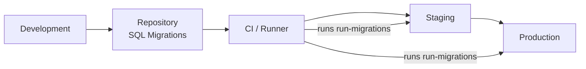
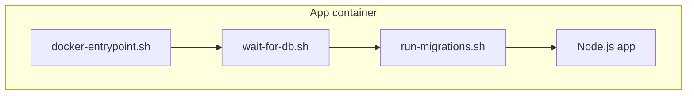

## 🗄️ Pattern: Database Migrations

> Versioned management of the database schema with automated deployment.

---

## 📋 Overview

SQL migration system designed for:

- **Version control** of the schema.
- **Sequential execution** to maintain correct order.
- **Idempotent operations**: safe to run multiple times.
- **Automated deployment** (integration with Docker/entrypoint).

---

## ⚙️ Requirements & Compatibility

- Database: PostgreSQL 16/15 (Alpine image recommended for containers).
- Application client/driver: `pg` npm module (used for Node.js access).
- CI/environment tools: `psql` available in the container or runner executing migrations.

Note: This repository shows public fragments and examples; full scripts and dumps are kept in private repositories.

## ✅ Key Details to Review & Adapt

- Force early failure in `psql` by adding `-v ON_ERROR_STOP=1` to prevent migrations from continuing after a partial error.
- Consider locking tables if concurrent executions are possible (e.g., `LOCK TABLE ... IN EXCLUSIVE MODE;`).
- Document a strategy for checksums or hashes if you want to detect changes in already-applied files in the future (currently only the filename is tracked).

---

## 🔐 Environment Variables

Environment variables are used so containers and scripts do not contain secrets.

- Variables used in repo scripts (real example): `PGUSER`, `PGDATABASE`, `PGHOST`, `PGPASSWORD`, `PGPORT`, `APP_ENV`.
- Equivalent variables for other environments: `PG_USER`, `PG_DBNAME`, `PG_HOST`, `PG_PASSWORD`.

Recommendation: Choose a single naming scheme and document the mapping in the image/container environment settings.

---

## :cloud: Migration Tracking (Optional)

Instead of enforcing a single integrated strategy, document options for migration tracking and let the team or deployment tool choose. Some alternatives:

- Use a custom table in the database to record applied files (for internal control).
- Delegate versioning to migration tools like Flyway, Liquibase, or similar.
- Maintain control via pipeline/CI (tagging and logs) and rely on script idempotency.

Each project can choose the option that best fits its scalability and operational requirements.

---

## 🧩 Note on `run-migrations.sh` and `pg`

The actual app script uses `psql` to apply dumps and migrations. The Node.js application uses `pg` for runtime connections.

Example client check in `run-migrations.sh`:

```sh
if [ -x "$(command -v psql)" ]; then
    echo "PostgreSQL client found"
else
    echo "PostgreSQL client not found, skipping migrations"
    exit 0 # You may change this to an error if preferred
fi
```

---

## 🏗️ Recommended Structure

Organize SQL files in clear folders:

```text
database/
├── migrations/    # Sequential migration files
│   ├── 001_init.sql
│   ├── 002_shop.sql
│   ├── 003_add_indexes.sql
│   └── 004_user_roles.sql
├── seeds/        # Initial or test data
│   ├── core/     # Essential app data
│   ├── dev/      # Development environment data
│   └── demo/     # Demo environment data
└── dumps/        # For backups or restores only
    └── initial_dump.sql
```

- Use sequential and descriptive names (`001_description.sql`).
- Separate data migrations (`seeds/`) and dumps (`dumps/`).

---

## 📝 Example Migration

### 001_init.sql (Initial Schema)

```sql
-- Migration: 001 - Initial Schema
-- Description: Create users table with authentication
-- Author: Angeles-HO
-- Date: 2025-11-18

BEGIN;
CREATE TABLE IF NOT EXISTS users (
    id SERIAL PRIMARY KEY,
    username VARCHAR(255) UNIQUE NOT NULL,
    email VARCHAR(255) UNIQUE NOT NULL,
    password_hash VARCHAR(255) NOT NULL, -- Store password hash (not plain text)
    role VARCHAR(50) DEFAULT 'user', -- roles: user, admin
    created_at TIMESTAMP DEFAULT CURRENT_TIMESTAMP,
    updated_at TIMESTAMP DEFAULT CURRENT_TIMESTAMP
);

CREATE INDEX IF NOT EXISTS idx_users_email ON users(email); -- Index for email searches

CREATE OR REPLACE FUNCTION update_timestamp()
RETURNS TRIGGER AS $$
BEGIN
    NEW.updated_at = CURRENT_TIMESTAMP;
    RETURN NEW;
END;
$$ LANGUAGE plpgsql;

CREATE TRIGGER users_updated_at
    BEFORE UPDATE ON users
    FOR EACH ROW
    EXECUTE FUNCTION update_timestamp();

COMMIT;
```

### 002_shop.sql

```sql
-- Migration: 002 - E-commerce Tables
-- Description: Products, categories, and cart tables
-- Author: Angeles-HO
-- Date: 2025-11-18

BEGIN;

CREATE TABLE IF NOT EXISTS categories (
    id SERIAL PRIMARY KEY,
    name VARCHAR(255) NOT NULL,
    description TEXT,
    parent_id INTEGER REFERENCES categories(id), -- Self-reference for hierarchical categories
    created_at TIMESTAMP DEFAULT CURRENT_TIMESTAMP
);

CREATE TABLE IF NOT EXISTS products (
    id SERIAL PRIMARY KEY,
    name VARCHAR(255) NOT NULL,
    description TEXT,
    price DECIMAL(10, 2) NOT NULL,
    stock INTEGER DEFAULT 0,
    category_id INTEGER REFERENCES categories(id),
    image_url VARCHAR(500),
    created_at TIMESTAMP DEFAULT CURRENT_TIMESTAMP,
    updated_at TIMESTAMP DEFAULT CURRENT_TIMESTAMP
);

CREATE TABLE IF NOT EXISTS cart (
    id SERIAL PRIMARY KEY,
    user_id INTEGER REFERENCES users(id) ON DELETE CASCADE, -- For authenticated users
    session_id VARCHAR(255), -- For unauthenticated users
    created_at TIMESTAMP DEFAULT CURRENT_TIMESTAMP,
    CONSTRAINT cart_user_or_session CHECK (
        (user_id IS NOT NULL AND session_id IS NULL) OR
        (user_id IS NULL AND session_id IS NOT NULL)
    ) -- Ensures only one of the two fields is present
);

CREATE TABLE IF NOT EXISTS cart_items (
    id SERIAL PRIMARY KEY,
    cart_id INTEGER REFERENCES cart(id) ON DELETE CASCADE,
    product_id INTEGER REFERENCES products(id),
    quantity INTEGER NOT NULL DEFAULT 1,
    added_at TIMESTAMP DEFAULT CURRENT_TIMESTAMP,
    CONSTRAINT unique_cart_product UNIQUE (cart_id, product_id) -- Prevents duplicates in the same cart
);

CREATE INDEX IF NOT EXISTS idx_products_category ON products(category_id);
CREATE INDEX IF NOT EXISTS idx_cart_user ON cart(user_id);
CREATE INDEX IF NOT EXISTS idx_cart_session ON cart(session_id);
CREATE INDEX IF NOT EXISTS idx_cart_items_cart ON cart_items(cart_id);

COMMIT;
```

---

## 🚀 Automated Deployment (Script Example)

### run-migrations.sh

The script checks the connection and applies SQL files in order.

The strategy for tracking which migrations have been applied is up to the team (custom DB table, external tool, or pipeline logs).

An attempt was made to create a script that recorded applied migrations in a `schema_migrations` table, but it was excluded to keep things simple and adaptable. This also avoids risks if a migration fails midway and is incorrectly marked as applied.

Below is an adapted fragment of `run-migrations.sh`:

```sh
#!/bin/sh

if [ -x "$(command -v psql)" ]; then
    echo "PostgreSQL client found"
else
    echo "PostgreSQL client not found, skipping migrations"
    exit 0
fi
```

If you want to avoid re-executions or keep a history, consider integrating a dedicated solution or implementing pipeline-controlled logging.

---

## 🐳 Docker Integration

- The `docker-entrypoint.sh` can wait for the database and run `run-migrations.sh` before starting the application.
- Copy SQL and scripts to the container and mark scripts as executable in the Dockerfile.

Example Dockerfile (summary): copy `database/migrations` and `scripts/deploy`, mark with `chmod +x`, and use an `ENTRYPOINT` that runs migrations.

---

## 📌 Useful Snippets (Adapted from Repo)

Here are small fragments adapted from the repo to clarify behavior:

- Check and execute the initial migration (`./database/migrations/001_init.sql`):

```sh
echo "[LOG] Running initial migration: ./database/migrations/001_init.sql"
psql -U "$PGUSER" -d "$PGDATABASE" -h "$PGHOST" -f ./database/migrations/001_init.sql
```

- Loop to apply the rest of migrations and seeds (ordered):

```sh
for file in ./database/migrations/*.sql; do
    if [ "$file" != "./database/migrations/001_init.sql" ]; then
        psql -U "$PGUSER" -d "$PGDATABASE" -h "$PGHOST" -f "$file"
    fi
done
```

---

## 🔄 Rollback Strategy

- Preferred: write reversible migrations (UP/DOWN) or separate `down` scripts.
- Manual: execute rollback SQL and remove the record if using a tracking table.

Example (documented UP/DOWN):

```sql
-- UP: CREATE INDEX ...
-- DOWN: DROP INDEX ...
```

---

## 🧪 Testing

- Create a local testing database and run migrations against it.
- Test idempotency by running them twice: the second pass should skip already-applied migrations.

Useful commands:

```bash
docker-compose exec postgres psql -U myuser -c "CREATE DATABASE test_db;"
PG_DBNAME=test_db ./scripts/deploy/run-migrations.sh
docker-compose exec postgres psql -U myuser -d test_db -c "\dt"
```

---

## 🧭 Diagrams

Basic deployment flow:



Container architecture (entrypoint):



---

## 🎯 Best Practices

- **Naming convention:** `XXX_description.sql` with sequential prefix.
- **Transactions:** wrap changes in `BEGIN; ... COMMIT;` to avoid partial states.
- **Idempotency:** use `IF EXISTS / IF NOT EXISTS` when possible.
- **Separate data/schema:** keep data migrations in separate files.
- **Tracking:** maintain a record of applied migrations (filename and timestamp) if needed.

---

## 📈 Recommended Deployment Flow

1. Development: create migration locally, test, commit.
2. Staging: deploy and verify migrations.
3. Production: execute during maintenance window, monitor logs.
4. Verification: review migration history and app tests.

---

## 🔍 Troubleshooting

- Check container logs and migration files.
- Review pipeline logs and deployment records to identify which migrations were executed.
- If a migration fails partially: fix the script, apply `down`, or manually validate in staging before marking as resolved.

---

## 🌟 Advantages

- **Version control**: schema is in code.
- **Reproducible**: same steps across environments.
- **Automatable**: CI/CD and Docker integration.

**Safe**: transactions prevent partial changes.
**Auditable**: history of applied migrations.

---

#### When this approach may not fit

- Large teams with parallel schema changes
- Complex rollback requirements
- Strong audit/compliance needs

<p align="center">
    <i>Evolve your schema with confidence</i>
</p>
