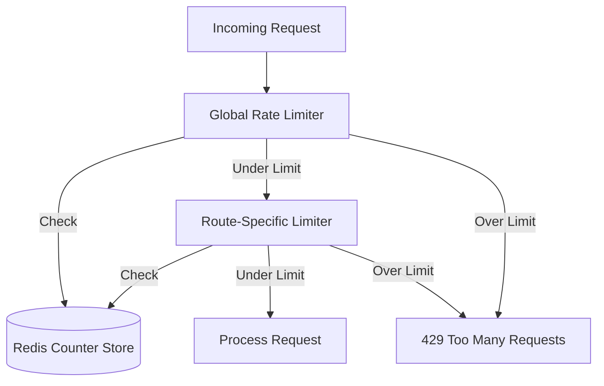
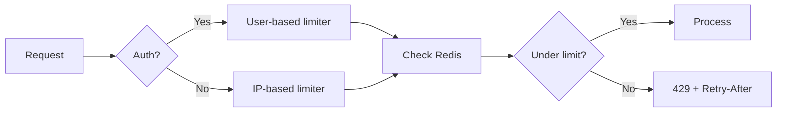

# ⚡ Rate Limiting Pattern

  

> Multi-tier request throttling system to prevent abuse and ensure fair resource allocation.

---

## 📋 Overview

Rate limiting implementation that provides:

- **DDoS Protection** - Prevent resource exhaustion
- **Brute-Force Mitigation** - Slow down credential attacks
- **Fair Usage** - Ensure equitable resource distribution
- **Flexible Configuration** - Per-endpoint and global limits

---

## 🏗️ Architecture

### **Rate Limiting Tiers**



### **Flow by Identity**



---

## 🔧 Implementation

### **Basic Configuration**

```javascript
import rateLimit from 'express-rate-limit';
import RedisStore from 'rate-limit-redis';
import { redisClient } from './redisClient.js';

// Global rate limiter
const globalLimiter = rateLimit({
  store: new RedisStore({
    client: redisClient,
    prefix: 'rl:global:',
  }),
  windowMs: 15 * 60 * 1000, // 15 minutes
  max: 100, // 100 requests per window
  standardHeaders: true, // Return rate limit info in headers
  legacyHeaders: false,
  message: {
    error: 'Too many requests from this IP, please try again later.',
  },
});

// Login rate limiter (stricter)
const loginLimiter = rateLimit({
  store: new RedisStore({
    client: redisClient,
    prefix: 'rl:login:',
  }),
  windowMs: 15 * 60 * 1000, // 15 minutes
  max: 5, // 5 login attempts per window
  skipSuccessfulRequests: true, // Only count failed attempts
  message: {
    error: 'Too many login attempts, please try again later.',
  },
});

// API rate limiter
const apiLimiter = rateLimit({
  windowMs: 60 * 1000, // 1 minute
  max: 30, // 30 requests per minute
  standardHeaders: true,
});
```

---

## 🎯 Usage Examples

### **Application-Wide**

```javascript
// Apply to all routes
app.use(globalLimiter);

// Specific endpoints
app.post('/login', loginLimiter, loginHandler);
app.post('/register', loginLimiter, registerHandler);
app.use('/api/', apiLimiter);
```

### **Custom Key Generator**

```javascript
// Rate limit by user ID instead of IP
const userLimiter = rateLimit({
  store: new RedisStore({
    client: redisClient,
    prefix: 'rl:user:',
  }),
  keyGenerator: (req) => {
    return req.session?.userId || req.ip;
  },
  max: 50,
});
```

### **Skip Conditions**

```javascript
const smartLimiter = rateLimit({
  skip: (req) => {
    // Skip rate limiting for whitelisted IPs
    const whitelist = ['127.0.0.1', '::1'];
    return whitelist.includes(req.ip);
  },
  skipSuccessfulRequests: true, // Only count errors
  max: 100,
});
```

---

## 🔗 Session integration

This strategy complements [patterns/redis-session-strategy.md](redis-session-strategy.md#-session-model):

- Same Redis instance for sessions and rate limiting
- Separate keys (`sess:*` vs `rl:*`)
- Lower latency by sharing the connection

---

## 🔐 Security Strategies

### **1. Login Protection**

```javascript
const loginLimiter = rateLimit({
  windowMs: 15 * 60 * 1000, // 15-minute window
  max: 5, // 5 attempts
  skipSuccessfulRequests: true, // Only count failed logins
  handler: (req, res) => {
    res.status(429).json({
      error: 'Too many login attempts',
      retryAfter: res.getHeader('Retry-After'),
    });
  },
});

app.post('/login', loginLimiter, async (req, res) => {
  const user = await authenticateUser(req.body);

  if (!user) {
    // Failed login - counted by limiter
    return res.status(401).json({ error: 'Invalid credentials' });
  }

  // Successful login - not counted
  res.json({ success: true });
});
```

### **2. API Abuse Prevention**

```javascript
// Tiered limits based on authentication
const publicApiLimiter = rateLimit({
  windowMs: 60 * 1000,
  max: 10, // 10 requests/minute for unauthenticated
});

const authenticatedApiLimiter = rateLimit({
  windowMs: 60 * 1000,
  max: 100, // 100 requests/minute for authenticated
});

app.use('/api', (req, res, next) => {
  if (req.session?.userId) {
    return authenticatedApiLimiter(req, res, next);
  }
  publicApiLimiter(req, res, next);
});
```

### **3. CSRF Brute-Force Protection**

```javascript
const csrfLimiter = rateLimit({
  windowMs: 5 * 60 * 1000, // 5 minutes
  max: 5, // 5 failed CSRF validations
  keyGenerator: (req) => {
    return req.sessionID; // Per-session limit
  },
  skipSuccessfulRequests: true,
});

// Integrated with CSRF middleware
function validateCsrf(req, res, next) {
  const isValid = checkCsrfToken(req);

  if (!isValid) {
    csrfLimiter(req, res, () => {
      res.status(403).json({ error: 'Invalid CSRF token' });
    });
  } else {
    next();
  }
}
```

---

## 📈 Response Headers

### **Standard Headers**

```http
RateLimit-Limit: 100
RateLimit-Remaining: 73
RateLimit-Reset: 1736781600
Retry-After: 847
```

### **Client-Side Handling**

```javascript
fetch('/api/data').then((response) => {
  if (response.status === 429) {
    const retryAfter = response.headers.get('Retry-After');
    console.log(`Rate limited. Retry after ${retryAfter} seconds`);
  }
  return response.json();
});
```

---

## 🎛️ Configuration Options

### **Window-Based Limiting**

```javascript
{
  windowMs: 15 * 60 * 1000,  // Time window in milliseconds
  max: 100,                   // Max requests per window

  // Behavior
  skipSuccessfulRequests: false,  // Count all requests
  skipFailedRequests: false,      // Count all requests

  // Headers
  standardHeaders: true,          // RateLimit-* headers
  legacyHeaders: false,           // X-RateLimit-* headers

  // Custom responses
  message: 'Too many requests',
  statusCode: 429,

  // Key generation
  keyGenerator: (req) => req.ip,

  // Skip conditions
  skip: (req) => false,

  // Store
  store: new RedisStore({...})
}
```

---

## 🧪 Testing

### **Rate Limit Test**

```bash
#!/bin/bash
# Test rate limiting

URL="http://localhost:3000/api/test"
LIMIT=30

echo "Testing rate limit ($LIMIT requests)..."

for i in $(seq 1 35); do
  echo "Request $i:"
  curl -s -w "Status: %{http_code}\n" $URL

  if [ $i -eq 31 ]; then
    echo "Expected 429 Too Many Requests"
  fi
done
```

---

## 🔄 Advanced Patterns

### **Progressive Delays**

```javascript
// Increase delay with each failed attempt
let attempts = 0;

const progressiveLimiter = rateLimit({
  windowMs: 60 * 1000,
  max: 10,
  handler: async (req, res) => {
    attempts++;
    const delay = Math.min(attempts * 1000, 10000); // Max 10s

    await sleep(delay);
    res.status(429).json({
      error: 'Too many requests',
      retryAfter: delay / 1000,
    });
  },
});
```

---

## 📊 Monitoring

### **Metrics Collection**

```javascript
// Track rate limit hits
const metrics = {
  totalRequests: 0,
  rateLimitedRequests: 0,
};

app.use((req, res, next) => {
  metrics.totalRequests++;

  const originalSend = res.send;
  res.send = function (data) {
    if (res.statusCode === 429) {
      metrics.rateLimitedRequests++;
    }
    originalSend.call(this, data);
  };

  next();
});

// Expose metrics endpoint
app.get('/metrics', (req, res) => {
  res.json({
    ...metrics,
    rateLimitPercentage: (
      (metrics.rateLimitedRequests / metrics.totalRequests) *
      100
    ).toFixed(2),
  });
});
```

---

## 🌟 Best Practices

✅ **Use Redis Store** - Shared state across servers  
✅ **Different Limits per Endpoint** - Stricter for sensitive routes  
✅ **Skip Successful Requests** - For login/authentication  
✅ **Include Retry-After Header** - Help clients backoff properly  
✅ **Monitor Rate Limit Hits** - Detect attacks or adjust limits  
✅ **Whitelist Internal IPs** - Don't limit monitoring/health checks

---

## 🎯 Common Configurations

```javascript
// Public API: 60 requests/minute
{ windowMs: 60000, max: 60 }

// Login: 5 attempts/15 minutes
{ windowMs: 900000, max: 5, skipSuccessfulRequests: true }

// Password Reset: 3 attempts/hour
{ windowMs: 3600000, max: 3 }

// File Upload: 10 uploads/hour
{ windowMs: 3600000, max: 10 }

// Search: 30 searches/minute
{ windowMs: 60000, max: 30 }
```

### Route matrix

| Route          | Window | Max | Notes                        |
| -------------- | ------ | --- | ---------------------------- |
| `/login`       | 15 min | 5   | Only failed attempts counted |
| `/api/public`  | 1 min  | 30  | IP-based                     |
| `/api/private` | 1 min  | 100 | User-based; auth required    |
| `/upload`      | 1 hour | 10  | Prevent storage abuse        |

## 🔗 Session integration

This strategy complements [patterns/redis-session-strategy.md](patterns/redis-session-strategy.md):

- Same Redis instance for sessions and rate limiting
- Separate keys (`sess:*` vs `rl:*`)
- Lower latency by sharing the connection

---

<p align="center">
  <i>Fair usage through intelligent throttling</i>
</p>
