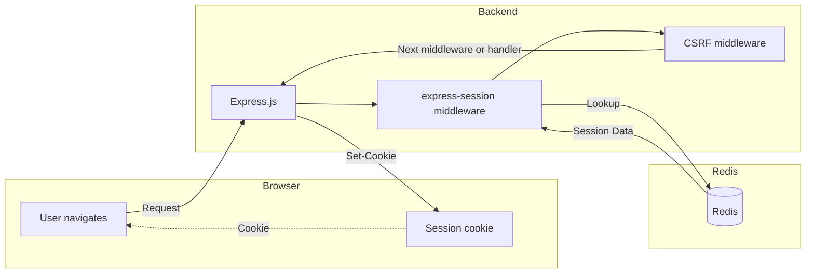
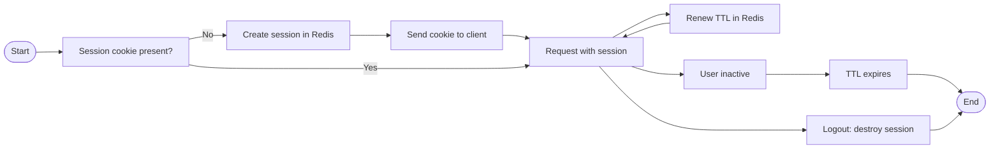

# Redis Session Strategy

> This strategy is designed for server-rendered and API-based web applications where session state is required (not for stateless JWT-only auth).
> Versioned managed strategy for storing user sessions in Redis for scalable web applications.
> Used in a SaaS application requiring high availability and scalability, with security middlewares (CSRF, rate limit, roles) and Redis as the session backend.

## Context & Problem

The application requires user sessions to maintain state across multiple requests. Sessions need to be persistent, scalable, and secure. In-memory session storage is not viable due to the need for horizontal scaling and persistence across server restarts.

## Goals

- Session persistence across restarts and deployments.
- Horizontal scalability without sticky sessions.
- Automatic and renewable session expiration.
- Security against common attacks (hijacking, fixation, XSS, CSRF).
- Easy inspection and debugging.

## Why Redis and not Memory/DB?

**Not always obvious, but critical for modern applications:**

- **Process restarts:** If the backend restarts (deploy, crash, etc.), in-memory sessions are lost. Redis persists (RDB/AOF) and keeps sessions alive.
- **Horizontal scaling:** With multiple servers, local memory is not shared. Redis allows any instance to access any session.
- **Sticky sessions vs stateless:** Without Redis, sticky sessions are required at the load balancer (user always hits the same backend), limiting scalability and fault tolerance. Redis enables truly stateless backends.
- **Acceptable latency:** Redis is extremely fast (<1ms typical on local network), much faster than a relational DB and fast enough for sessions.
- **Relational DB:** Slower, requires more space, and not optimized for TTL or session load.

**Summary:** Redis is the optimal point between persistence, speed, and scalability for sessions.

## Minimal Configuration Example

```js
import session from 'express-session';
import RedisStore from 'connect-redis';
import { redisClient } from './src/components/redis/redisClient.js';

const sessionConfig = {
  store: new RedisStore({
    client: redisClient,
    prefix: 'sess:',
    ttl: 900, // 15 minutes
  }),
  secret: process.env.SESSION_SECRET,
  resave: false,
  saveUninitialized: false,
  name: 'sessionId',
  cookie: {
    secure: process.env.NODE_ENV === 'production',
    httpOnly: true,
    maxAge: 900000,
    sameSite: 'strict',
    path: '/',
  },
  rolling: true,
};

app.use(session(sessionConfig));
// ...security middlewares, routes, etc.
```

## High-Level Architecture



- The user navigates and sends a session cookie.
- Express runs middlewares in chain: first `express-session` (which queries Redis), then CSRF (which validates tokens in the session), and finally the handler.
- Redis stores session data with TTL.
  > Only for routes that require session (not for static assets).

## Visual Example: Session Lifecycle



- If no cookie, a session is created and sent to the client.
- Each request renews the TTL if there is activity.
- If the user is inactive, the session expires automatically.
- Logout destroys the session manually.

## Session Model

**Concept:** Each session is a serialized (JSON) object stored in Redis under a unique key, typically with the `sess:` prefix and a TTL.

**Note:**  
The `cookie` object in the session is managed by the express-session middleware. You should not modify it manually; instead, configure cookie options via the session middleware. The session data (e.g., userId, cart, tokens) is safe to update.

**Real example:**

```js
// Stored in Redis:
Key: "sess:2f4ee0a8b15c9c3d1e2a4b5c"
Value:
{
  "cookie": {
    "originalMaxAge": 900000,
    "expires": "2026-01-14T15:30:00.000Z",
    "secure": true,
    "httpOnly": true,
    "sameSite": "strict",
    "path": "/"
  },
  "userId": 12345,
  "username": "user@example.com",
  "csrfTokens": [
    {
      "tokenId": "abc123...",
      "hash": "def456...",
      "expires": 1786781000000
    }
  ],
  "cart": {
    "items": [
      { "productId": 1, "qty": 2 }
    ],
    "total": 99.99
  }
}
// TTL: 900 seconds
```

Notes:

- Session payload should remain small to avoid Redis memory pressure.
- CSRF tokens are bounded and periodically rotated.
- Large or persistent data should live in the database, not the session.
  > Simplified example for documentation purposes.

**Access snippets:**

```js
// Store data in session
req.session.userId = user.id;
req.session.cart = { items: [], total: 0 };

// Read data
const userId = req.session.userId;
const cart = req.session.cart;

// Destroy session (logout)
req.session.destroy((err) => {
  if (err) console.error('Session destruction error:', err);
  res.clearCookie('sessionId');
});
```

**Expiration: TTL ≠ user timeout**

- The TTL in Redis is the maximum session lifetime since last activity (rolling).
- If the user is active, the TTL is renewed on each request (if `rolling: true`).
- If the user closes the browser but the cookie does not expire, the session may remain alive until the TTL expires.
- The user timeout (e.g., showing "session expired") depends on frontend and backend logic, but the session in Redis may live a bit more or less depending on activity and clock sync.

**Note:** TTL is automatic and managed by Redis, no manual cleanup required.

## Session Lifecycle

1. User visits the site: no session.
2. User logs in: session is created and stored in Redis.
3. User makes requests: cookie is sent, session is renewed (rolling).
4. Inactivity: session expires automatically by TTL.
5. Logout: session is destroyed manually and cookie is cleared.

## Expiration & Renewal

- Configurable TTL (e.g., 15 minutes).
- `rolling: true` option to renew TTL on each request.
- Automatic expiration in Redis, no manual cleanup.
- Cookie configuration aligned with Redis TTL.

## Security Considerations

- Cookie: `secure`, `httpOnly`, `sameSite: 'strict'`.
- Strong secret in production (`SESSION_SECRET`).
- Fixation prevention: regenerate session after login.
- Hijacking mitigation: associate user-agent/IP and validate on each request.
- CSRF tokens stored in session.
- Do not create session until data is stored (`saveUninitialized: false`).

**Example: Associate user-agent/IP for hijacking mitigation**

You can add a middleware after login to store a hash of the user-agent and IP in the session, and validate it on each request:

```js
// After successful login
req.session.uaHash = hash(req.headers['user-agent'] + req.ip);

// On each request (middleware)
if (req.session.uaHash !== hash(req.headers['user-agent'] + req.ip)) {
  // Possible hijacking attempt
  req.session.destroy(() => {});
  return res.status(403).json({ error: 'Session validation failed.' });
}
```
> Use a secure hash function (e.g., SHA256) for `hash()`.

## Failure Scenarios

- Redis down: sessions cannot be recovered or created (the app must handle connection errors).
- Unexpected expiration: users disconnected if TTL is too short.
- Data loss: if Redis persistence (RDB/AOF) is disabled.
- TTL desynchronization between cookie and Redis.

## Scaling Considerations

- Redis allows sharing sessions between multiple backend instances.
- No sticky sessions required at the load balancer.
- Redis can be clustered or replicated.
- Key prefixes to isolate environments or data types.

## Alternatives Considered

- In-memory sessions: do not persist or scale.
- Relational database storage: slower, more complex.
- JWT in cookies: stateless, but no revocation or renewable expiration.

## When NOT to Use This

- Small or monolithic applications with no need to scale.
- When network latency to Redis is high.
- If session persistence across restarts is not required.
- If a pure stateless (JWT) approach is preferred.

## Recommendations & Lessons Learned

- **Avoid storing large data in the session.** Keep the session small (only IDs, flags, tokens). Large or persistent data should go in the database.
- **Handle Redis failures with graceful degradation.** If Redis is down, show clear messages or allow limited access, not generic 500 errors.
- **Monitor Redis memory usage to avoid saturation.** Use alerts and memory limits, and review session sizes.
- **Rotate and limit CSRF tokens in the session.** Do not accumulate old tokens, clean up periodically.
- **Synchronize cookie TTL and Redis TTL.** To avoid "zombie" sessions or unexpected expirations.
- **Do not store sensitive data unencrypted.** Sessions can be read by Redis administrators.
- **Audit and monitor session access and errors.** To detect anomalous patterns or attack attempts.
- **Recovery testing:** Simulate Redis outages and verify user experience and logs.

## References & Useful Links

- [express-session (npm)](https://www.npmjs.com/package/express-session) — Express session middleware.
- [connect-redis (npm)](https://www.npmjs.com/package/connect-redis) — Redis session store for express-session.
- [Redis Official Documentation](https://redis.io/docs/)
- [Redis Labs (Managed Service)](https://redis.com/)
- [Node.js Sessions Best Practices (OWASP)](https://cheatsheetseries.owasp.org/cheatsheets/Session_Management_Cheat_Sheet.html)
- [Express.js Security Best Practices](https://expressjs.com/en/advanced/best-practice-security.html)

---

<p align="center">
  <i>Designed for real systems, not idealized ones.</i>
</p>
