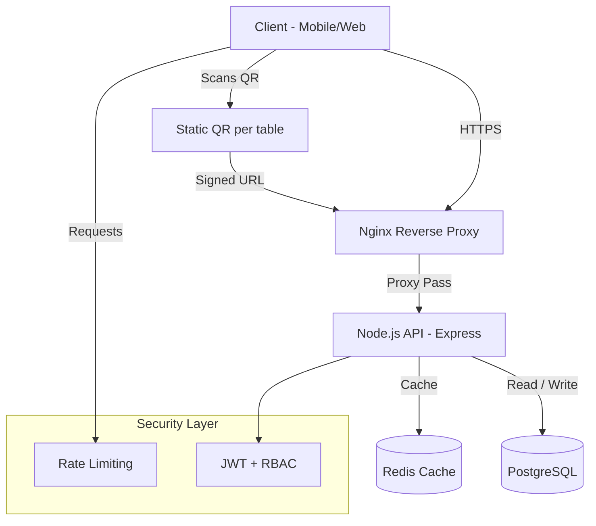

# Digital Menu Platform with QR

> Digital menu with QR generation, table ordering, and real-time admin panel.

---

## Introduction

### Digital Menu as a Presentation Layer for a Legacy System

> **Problem:** A restaurant with a robust order management system suffered from a slow and unattractive online menu layer, hurting the customer experience.
>
> **Solution:** Designed and implemented a lightweight, standalone application whose sole purpose is to deliver a modern, fast, and usable digital menu, integrating non-invasively with the existing core system.

The app is built with Node.js + Express, PostgreSQL, and Redis for cache; the frontend uses vanilla HTML/CSS/JS for fast loading and smooth UX. It deploys with Docker Compose/Dockerfiles to simplify service operations.

## Why It Works (Impact and Risk)

- Fast impact: drastic improvement to customer experience without touching the core.
- Low risk: decoupled app; a failure does not affect the main order flow.
- Scalability: the presentation layer can scale horizontally (more Node.js instances + Redis cluster) without depending on legacy.
- Flexibility: the frontend can be redesigned for events or seasons because the business logic remains isolated.

## 🛠️ Stack and Implementation

Stack chosen to prioritize performance, simplicity, and maintainability.

| Layer         | Chosen technology     | Why for this problem                                                 |
| ------------- | --------------------- | -------------------------------------------------------------------- |
| Frontend      | HTML, CSS, JS vanilla | Maximum speed; zero overhead, ideal for QR on mobile                 |
| Backend (API) | Node.js + Express     | Lightweight and fast; acts as smart proxy and simple server          |
| Cache         | Redis                 | Instant responses by caching the catalog and avoiding hits to legacy |
| Proxy / SSL   | Nginx                 | Efficiently serves static assets and handles SSL                     |
| Containers    | Docker Compose        | Consistent deployment packaging app and cache reproducibly           |

## 🔎 Technical Details and Operation

- Menu cache with a 5-minute TTL (implemented in memory; can be mounted on Redis for multi-instance) to reduce DB/legacy reads.
- SQL queries with joins on menu_items/menu_categories to deliver a structured, ordered menu in a single call.
- Environment-based configuration via variables: PG_HOST, PG_DATABASE, PG_USER, PG_PASSWORD, REDIS_URL, LEGACY_API_URL; main entry in server/server.mjs.
- SQL seeds and migrations in database/migrations and database/seeds/core to initialize and version the catalog.

## ✨ Value Proposition: Extend, Not Replace

The key insight was that the central system (orders, inventory, kitchen) worked well. The bottleneck was the customer-facing interface.

**Technical proposal:**

1. Decouple presentation with an independent app (`menu-digital-api`) focused on showing the menu and capturing order intent.
2. Keep the legacy system as the source of truth for prices, availability, and processing.
3. Connect both via a well-defined REST API, minimizing risk and impact.

## 📊 System Architecture



---

## 🏗️ Overview

### **3-Layer Architecture**

```
┌─────────────────────────────────────────┐
│ Presentation Layer (HTML/JS/CSS)        │
└─────────────────────────────────────────┘
        ↓
┌─────────────────────────────────────────┐
│ Application Layer (Controllers/Services │
│ + Security Middleware)                  │
└─────────────────────────────────────────┘
        ↓
┌─────────────────────────────────────────┐
│ Data Layer (PostgreSQL + Redis)         │
└─────────────────────────────────────────┘
```

### **Project Structure (summary)**

```
apps/
├── backend/
│   └── src/
│       ├── controllers/   # request handling
│       ├── services/      # business logic (menus, orders, tables)
│       ├── models/        # data models (Sequelize/SQL)
│       ├── middleware/    # security and validation
│       └── components/    # shared utilities
└── frontend/
│   └── src/
│       ├── pages/         # HTML views (home)
│       ├── services/      # API clients
│       ├── components/    # UI (navbar, menu, footer)
│       └── styles/        # modular CSS
server/
  └── app.js       # entry point
  └── server.mjs   # server configuration
```

---

## 🔐 Security

- Rate limiting: global and per-endpoint levels, backed by Redis.
- Validation and sanitization: inputs cleaned in controllers.

---

## 🚀 Key Modules

### **Menu Module**

- Categories, items, prices, and availability by schedule.
- Menu per table via signed URL with QR.

### **Admin Panel**

- Menu management (CRUD).

---

## 📦 Environment Configuration

- Production: strong secrets (JWT_SECRET), secure cookies, DB pool, persistent Redis.
- Development: nodemon/hot-reload, verbose logs, permissive CORS.

---

## 🧪 Testing

```
tests/
├── unit/         # business logic
├── integration/  # endpoints (menu)
```

---

## 🔄 Deployment

```
Dockerfiles and docker-compose.yml:
Create four services:
- nginx         : proxy + static assets
- api           : Node.js/Express
- db            : PostgreSQL
- redis         : cache
```

Internal network, discovery by name, volumes for persistence, health checks on API and DB.

---

## 🌟 Highlights

- QR per table.
- Cache in Redis.
- Ready to scale horizontally (stateless API + Redis).
- Clear documentation and architecture.

<p align="center"><em>A project that shows you can add value and modernize the user experience without rewriting entire legacy systems.</em></p>
