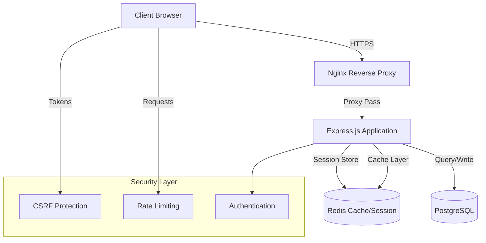

# 🛍️ E-commerce Cosmetics Platform

> Full-stack e-commerce application with advanced security features and real-time cart management.

---

## 📊 System Architecture



---

## 🏗️ Architecture Overview

### **3-Tier Architecture**

```
┌─────────────────────────────────────────┐
│         Presentation Layer              │
│  (Static HTML/CSS/JS + Client Logic)    │
└─────────────────────────────────────────┘
                    ↓
┌─────────────────────────────────────────┐
│         Application Layer               │
│    Controllers → Services → Models      │
│   (Business Logic + Security)           │
└─────────────────────────────────────────┘
                    ↓
┌─────────────────────────────────────────┐
│         Data Layer                      │
│   PostgreSQL (Primary) + Redis (Cache)  │
└─────────────────────────────────────────┘
```

### **Project Structure**

```
apps/
├── backend/
│   └── src/
│       ├── controllers/     # Request handlers
│       ├── services/        # Business logic
│       ├── models/          # Data models
│       ├── middleware/      # Security & validation
│       └── components/      # Shared utilities
└── frontend/
    └── src/
        ├── pages/           # HTML views
        ├── services/        # API clients
        ├── components/      # UI components
        └── styles/          # CSS modules
```

---

## 🔐 Security Features

### 1. **Custom CSRF Protection**

- Token-based implementation with session binding
- Automatic token rotation on login/logout
- Double-submit cookie pattern
- See: [CSRF Implementation Pattern](../../patterns/csrf-implementation.md)

### 2. **Rate Limiting**

- Multi-tier throttling (global + endpoint-specific)
- Redis-backed counter storage
- Configurable limits per route
- See: [Rate Limiting Pattern](../../patterns/rate-limiting.md)

### 3. **Session Security**

- Redis-backed session store
- HTTP-only secure cookies
- 15-minute session timeout
- See: [Redis Session Strategy](../../patterns/redis-session-strategy.md)

### 4. **Authentication & Authorization**

- JWT-based authentication
- Password hashing with bcrypt/argon2
- Role-based access control (RBAC)
- Input sanitization on all endpoints

---

## 🚀 Key Features

### **Shop Module**

- **Product Catalog**: Categories, filtering, pagination
- **Shopping Cart**: Session-based cart with Redis persistence
- **Search**: Product search with filters
- **Orders**: Order history and tracking

### **User Module**

- **Registration/Login**: Secure authentication flow
- **Profile Management**: User data CRUD operations
- **Session Management**: Active session tracking

### **Admin Features** (Planned)

- Product management
- Order processing
- User administration

---

## 🛠️ Tech Stack Details

### **Backend**

- **Runtime**: Node.js (ES6+ modules)
- **Framework**: Express.js
- **ORM**: Sequelize (PostgreSQL)
- **Session**: express-session + connect-redis
- **Security**: Helmet, CORS, custom middleware

### **Frontend**

- **Vanilla JavaScript** (ES6+)
- **HTML5** semantic structure
- **CSS3** with responsive design
- **No framework** - demonstrating vanilla JS skills

### **Database**

- **PostgreSQL**: Primary data store
  - Users, Products, Categories, Orders
  - Relationships with foreign keys
- **Redis**: Cache + Session store
  - Session data
  - Cart persistence
  - Rate limit counters

### **DevOps**

- **Docker Compose**: Multi-container setup
- **Nginx**: Reverse proxy + static file serving
- **Migrations**: SQL-based version control
- **Health Checks**: Database connection monitoring

---

## 📈 Data Flow Examples

### **User Login Flow**

```
1. Client → POST /login (credentials)
2. Middleware → Validate input + CSRF token
3. Service → Verify credentials (bcrypt)
4. Session → Create session in Redis
5. Response → Set secure cookies + JWT
6. Client → Store session, redirect to dashboard
```

### **Add to Cart Flow**

```
1. Client → POST /cart/add (product_id, quantity)
2. Middleware → Authenticate + validate
3. Redis → Check if cart exists for session
4. Service → Update cart data
5. Redis → Persist updated cart
6. Response → Return updated cart summary
```

---

## 🎯 Technical Challenges & Solutions

### **Challenge 1: Session Persistence Across Restarts**

**Problem**: In-memory sessions lost on server restart  
**Solution**: Redis-backed session store with configurable TTL

### **Challenge 2: CSRF Protection Without Library**

**Problem**: Need custom implementation for learning  
**Solution**: Built token-based system with session binding and automatic rotation

### **Challenge 3: Cart Data Structure**

**Problem**: Efficient storage and retrieval of cart items  
**Solution**: Redis hash structure with JSON serialization

### **Challenge 4: Database Migration Management**

**Problem**: Schema version control in team environment  
**Solution**: Sequential SQL migrations with Docker integration

---

## 🔄 Deployment Architecture

```
Docker Compose Environment:
┌─────────────────────────────────────────┐
│  nginx:latest (Port 80)                 │
│  - Reverse proxy                        │
│  - Static file serving                  │
└─────────────────────────────────────────┘
              ↓
┌─────────────────────────────────────────┐
│  Node.js App (Port 3000)                │
│  - Express server                       │
│  - Business logic                       │
└─────────────────────────────────────────┘
         ↓              ↓
┌──────────────┐  ┌──────────────┐
│ PostgreSQL   │  │ Redis        │
│ (Port 5432)  │  │ (Port 6379)  │
└──────────────┘  └──────────────┘
```

### **Container Communication**

- Custom Docker network
- Service discovery via container names
- Volume mounts for persistence
- Health check integration

---

## 📊 Performance Optimizations

- **Redis Caching**: Session data, cart persistence
- **Connection Pooling**: PostgreSQL connection reuse
- **Static Asset Serving**: Nginx handles CSS/JS/images
- **Lazy Loading**: Frontend pagination for large datasets
- **Prepared Statements**: Sequelize query optimization

---

## 🧪 Testing Strategy

```
tests/
├── unit/           # Component/function tests
├── integration/    # API endpoint tests
└── e2e/           # Full user flow tests
```

- CSRF token validation tests
- Rate limiting boundary tests
- Session management tests
- Database query tests

---

## 📦 Environment Configuration

```
Production:
- SESSION_SECRET: Cryptographically secure
- CSRF_SECRET: Rotated periodically
- Database: Connection pooling
- Redis: Persistent storage

Development:
- Hot reload: nodemon
- Debug logs: enabled
- CORS: Permissive for testing
```

---

## 🌟 Highlights

✅ **Production-Ready**: Currently serving real users  
✅ **Security-First**: Custom security implementations  
✅ **Scalable**: Horizontal scaling ready with Redis  
✅ **Clean Code**: MVC architecture with clear separation  
✅ **Docker-Native**: Full containerized environment  
✅ **Well-Documented**: Comprehensive inline documentation

---

## 📚 Related Documentation

- [CSRF Implementation](../../patterns/csrf-implementation.md)
- [Redis Session Strategy](../../patterns/redis-session-strategy.md)
- [Rate Limiting Pattern](../../patterns/rate-limiting.md)
- [Docker Setup](../../patterns/docker-compose-setup.md)
- [Database Migrations](../../patterns/database-migrations.md)

---

<p align="center">
  <i>Designed for security, built for scale</i>
</p>
