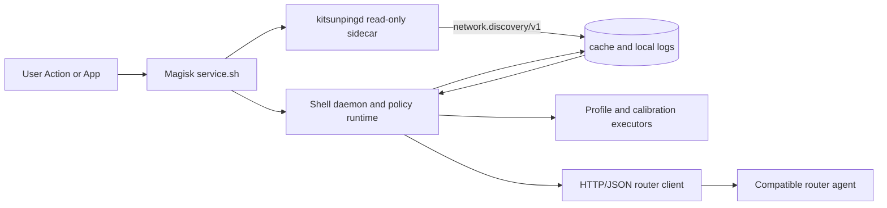

# Kitsunping Network Runtime Stack

> A rooted-Android network profile module with a bounded Rust observation sidecar and an optional, protocol-level router integration.

---

## Why This Project Matters

Kitsunping collects local connectivity state and applies explicitly configured
network profiles on rooted Android devices. Its runtime is deliberately hybrid:
Shell owns policy and device mutation, while `kitsunpingd` provides a narrow,
read-only Rust-first discovery contract with strict Shell fallback.

The module can exchange status and channel-request data with a compatible router
agent. Router implementation and deployment remain separate from this module;
the boundary is documented HTTP/JSON interoperability, not shared runtime code.

---

## Architecture Overview



---

## Core Components

### Android Magisk Module

- `installer/service.sh` starts separate Shell and native supervisors during the
  late service phase.
- The Shell runtime owns profiles, calibration, properties, router calls, and
  all network mutation.
- `kitsunpingd` writes atomic local state, discovers interfaces, routes, link
  state, and selected Wi-Fi/mobile metadata.
- `network.discovery/v1` uses Rust first only for validated discovery fields;
  stale, invalid, unavailable, or incomplete data triggers the legacy Shell
  collector.
- Local cache and logs provide diagnostics without background uploads.

### Native Sidecar: kitsunpingd

- Rust, Bionic-compatible AArch64 binary under `bin/kitsunpingd`.
- Read-only sources include `NETLINK_ROUTE`, procfs, sysfs, and bounded command
  backends for Android framework data not exposed by those sources.
- Single-instance PID/lock lifecycle, atomic state publication, interval-based
  collection, and cooperative signal shutdown.
- Experimental sources remain opt-in. They do not gain policy authority merely
  by being published.

### Router Boundary

- Kitsunping contains only the Android-side client for documented event,
  recommendation, and channel-apply requests.
- Compatible router agents, including KitsunpingRouter, are independent
  distributions with their own deployment and operational boundaries.
- Router-side QoS, Packet Priority Coloring (PPC), queueing, and channel logic
  are not bundled into the Android module payload.

---

## Security and Reliability Boundaries

- Explicit module/router protocol and licensing boundary.
- Rust observation cannot silently alter profiles, properties, calibration,
  router state, or network settings.
- Atomic state files, PID/lock ownership, bounded restart behavior, and strict
  fallback protect ordinary runtime operation.
- Device, router, and release validation are separate gates; a local build or
  state file is not treated as deployment evidence.

---

## Tech Stack

- **Languages**: POSIX-oriented Shell and Rust
- **Platform**: Rooted Android with Magisk-compatible module lifecycle
- **Native interfaces**: Bionic, `NETLINK_ROUTE`, procfs, sysfs, and optional
  Android command backends
- **Integration interfaces**: Documented HTTP/JSON client calls to compatible
  router agents
- **Operational model**: Shell policy runtime plus a narrow Rust observation
  sidecar

---

## Design Highlights

- A bounded Rust-first `network.discovery/v1` contract instead of a broad
  rewrite of Shell responsibilities.
- Read-only native state collection with reactive Shell fallback.
- Backward-compatible line-oriented state bridge between the sidecar and Shell
  consumers.
- Separate authority boundaries for observation, policy, router integration,
  and mutation.

---

## Networking Topics

- Active interface, route, link, and IPv4 discovery through native Linux
  sources with Shell compatibility fallback.
- Wi-Fi metadata collection through ordered `iw`, `wpa_cli`, and `dumpsys`
  adapters; direct `nl80211` remains an evaluated future backend.
- Mobile metadata, calibration, profile application, and Android property work
  remain Shell-owned until independently validated.
- Optional router event and channel coordination through documented endpoints.
- Router-side Packet Priority Coloring (PPC), queueing, and RF/channel work are
  presented as separate compatible-system capabilities.

---

## Implemented Capabilities

- Magisk late-service launch with separate Shell and native supervisors.
- Rust-first network discovery for validated interface, Wi-Fi/mobile link, IPv4,
  and default-route fields.
- Bionic AArch64 `kitsunpingd` lifecycle with atomic state snapshots and local
  capability diagnostics.
- Shell-owned `speed`, `stable`, and `gaming` profile execution, calibration,
  state handling, and recovery behavior.
- Client-side router event, recommendation, and channel-apply integration.

---

## Experimental And Gated Work

- Foreground-package cpuset source with a strict `dumpsys` fallback; it remains
  opt-in and is not the default runtime source.
- Direct Rust `nl80211` Wi-Fi acquisition, pending service-context SELinux and
  device-parity validation.
- Real ONNX inference, planned as opt-in observation only with ABI, battery,
  thermal, rollback, and output-validation gates.
- Extended router RF/channel capabilities, evaluated within the separate router
  distribution.

---

## Current Direction

- `v7.0.1`: complete stable validation of the module and approved native sidecar.
- `v7.0.2`: hardening and controlled packet-analysis work.
- `v7.0.3`: real ONNX integration only after the documented safety gates pass.
- Native backend work remains evidence-led: prototype, host checks, device
  parity, bounded rollout, and rollback before promotion.

---

## Repository Structure

```text
Kitsunping/
  installer/       Magisk lifecycle hooks and supervisors
  addon/           Shell daemon helpers, bundled command tools, policy adapters
  bin/             Packaged native sidecars (`kitsunpingd`, inference scaffold)
  network/         Shell cycles for app, Wi-Fi, and mobile surfaces
  policy/          Shell policy engine, execution, and profile selection
  net_profiles/    Profile definitions and device-tuning inputs
  calibration/     Calibration implementation and data
  Docs/            Runtime contracts, scope, safety, and release documentation
  testing/         Shell/runtime fixtures and integration scenarios
  tools/           Local validation and release-gate commands

Kitsunpingd/
  src/             Rust sidecar, contracts, acquisition, backends, providers
  tests/           Public sidecar contract checks
  tools/           Android/Bionic build helper
```

---

## References

- Module overview: https://github.com/Angeles-HO/kitsunping
- Runtime contract: `Kitsunping/Docs/10-runtime/kitsunping-kitsunpingd-contract.md`
- Router integration boundary: `Kitsunping/Docs/20-router/router-integration-boundary.md`

---

## Portfolio Note

This page documents architecture-level decisions and system boundaries for
professional review. It intentionally omits environment-specific credentials,
device identifiers, private router topology, and unpublished release claims.
