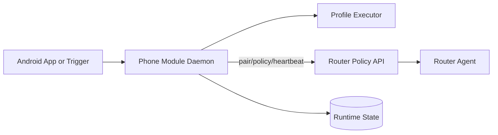

# Kitsunping Network Optimization Stack

> Android network optimization architecture combining on-device profile orchestration with router-side policy control.

---

## Why This Project Matters

Kitsunping tackles unstable mobile gaming/network conditions through adaptive profile execution on Android, while optionally integrating with a router-side policy engine for coordinated QoS behavior.

The stack is built around event-driven orchestration, signed protocol requests, and clear module boundaries between phone and router responsibilities.

---

## Architecture Overview

---

## Core Components

### On-device Module (Kitsunping)

- Event-driven daemon loop for connectivity and profile events.
- Profile application modes (for example: `gaming`, `speed`, `stable`, `benchmark_speed`, `benchmark_latency`).
- Local diagnostics and cache/log artifacts.
- Router protocol client integration through documented HTTP/JSON endpoints.

### Router-side Module (KitsunpingRouter)

- Policy contract engine for pair/policy/heartbeat lifecycle.
- Signed request validation and replay-protection behavior.
- Runtime state transitions and operational status inspection.
- Channel recommendation/apply endpoints and QoS-oriented scripts.
- DFS-based policy evaluation with guardrails for safe operation.

---

## Security and Reliability Boundaries

- Explicit client/router integration boundary.
- Signed protocol flow for policy operations.
- Runtime state-machine orientation (pair -> policy -> heartbeat -> revoke/sweep).
- Operational safety guidance to avoid destructive manual sequencing.

---

## Tech Stack

- **Languages**: Bash/Shell scripting
- **Platform**: Rooted Android + Router shell environment
- **Interfaces**: HTTP/JSON endpoints + CLI scripts
- **Operational model**: Event-driven daemon + stateful router policy runtime

---

## Design Highlights

- Separation between phone-side optimization and router-side enforcement.
- Contract-first policy protocol with explicit command lifecycle.
- Practical diagnostics and deploy scripts for real operational environments.
- Focus on reproducible behavior under variable network conditions.

---

## Networking Topics Covered (Router-Focused)

- Per-device QoS policy orchestration by `client_mac` identity.
- Signed API contract for `pair`, `policy`, and `heartbeat` operations.
- Anti-replay controls (`seq`, `nonce`, timestamp validation, signature checks).
- Packet marking and local traffic prioritization through Packet Priority Coloring (PPC).
- Queueing and pacing architecture (`nft` marking + `tc`/HTB integration path).
- Channel recommendation logic for 2.4 GHz/5 GHz with RF-aware scoring.
- Driver-aware scan fallbacks (including MediaTek-specific survey paths).
- Router/phone state synchronization, diagnostics, and controlled recovery flows.

---

## Existing Capabilities (Implemented)

- End-to-end policy protocol lifecycle with runtime states (`PAIRED_IDLE`, `ACTIVE_POLICY`, `EXPIRED`, `REVOKED`).
- Signed request validation and replay protection in router-side processing.
- PPC layer with class-based packet marking and runtime telemetry fields.
- Router diagnostics and deployment workflows for real OpenWrt-like environments.
- Read-only channel recommendation endpoint and JSON contract for app/module integration.

---

## Experimental Features

- Extended channel recommendation model for 2.4 GHz `full_1_13` candidates.
- RF scoring refinements: overlap weights, co-channel penalty, max-based normalization.
- Width/confidence inference and richer RF debug payloads.
- AP-driver constrained scan strategies with degraded-mode fallback.

---

## Currently Being Improved

- QoS consistency during `sweep`/`revoke` cleanup paths.
- Router docs modularization and duplicate-doc deprecation cleanup.
- Router agent internal modular split (`scripts/lib/*`) to reduce operational risk.
- Better operator clarity between safe daily commands and advanced diagnostic commands.

---

## Planned Roadmap (Networking)

- Stronger QoS scheduling maturity with explicit `tc`/HTB class consumption from marks.
- Safer and clearer channel-apply flow with explicit user confirmation gates.
- Additional hardening around deployment reproducibility and rollback behavior.
- More comparative RF validation against external analyzer tools for recommendation trust.
- Expanded observability for policy drift, replay rejection causes, and runtime health.

---

## References

- Module overview: https://github.com/Angeles-HO/kitsunping
- Router-side protocol docs: available in dedicated router documentation set (shared during technical review)

---

## Portfolio Note

This page documents architecture-level decisions and system boundaries for professional review. It avoids exposing sensitive environment-specific details while preserving technical depth.
