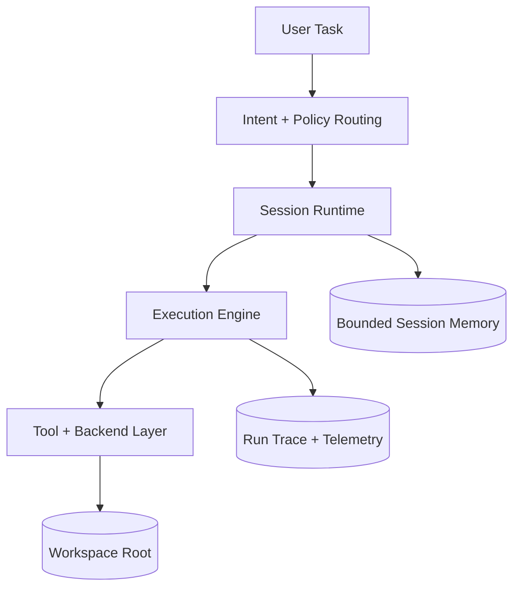

# Telvyn - Runtime

> A local-first agent runtime for technical work: investigate code, execute controlled actions, and return traceable results with explicit workspace boundaries.

---

## Project Status

- Latest published beta: `v0.2.3-beta`
- Next release target: `v0.2.4-beta`
- Current stabilization focus: exec-policy expansion, truthful telemetry, and operator cost visibility
- Current emphasis: reliable technical execution instead of generic chat UX

---

## Why This Project Matters

Telvyn - Runtime is built around a practical problem in agent systems: most assistants can sound capable, but many fail under real workspace constraints, weak tool policy, or poor traceability.

The runtime treats execution as an operator-controlled system rather than a loose chat loop. It separates intent routing, session continuity, workspace policy, and execution tracing so technical runs are inspectable and repeatable.

---

## System Architecture

---

## Core Runtime Model

### Conversation -> Session -> Run

- **Conversation**: logical continuity across related work.
- **Session**: mutable runtime state, active goals, pending actions, workspace binding, and bounded memory.
- **Run**: immutable execution record with outputs, telemetry, and final result state.

### What the runtime preserves

- bounded continuity between runs
- explicit confirm/cancel state for risky actions
- workspace and current-directory context
- run traces that support debugging and regression analysis

---

## Current Runtime Capabilities

- Deterministic workspace-read behavior for search/list/existence flows.
- External workspace binding through absolute project roots with scoped `cwd` control.
- Local-model and cloud-compatible backend support.
- CLI and Textual TUI surfaces for the same execution runtime.
- Cost visibility, compatibility validation, and prompt-optimization support for operators.
- Structured execution telemetry instead of optimistic success reporting.

---

## Key Design Decisions

### Deterministic workspace I/O

Workspace reads are handled with contract-driven logic rather than letting the model improvise filesystem state.

- No model-in-the-loop for read-path truth.
- In-scope path resolution only.
- Deterministic search/list/existence handling.
- Guardrails against traversal and out-of-scope access.

### Operator-first execution

The runtime exposes execution constraints directly: sandbox mode, compatibility checks, workspace binding mode, and traceable tool behavior are treated as first-class operator controls.

### Traceability over illusion

Telvyn favors truthful telemetry and reproducible artifacts over polished but unverifiable answers. The intended outcome is a runtime that can be trusted during technical work, not just demoed.

---

## Tech Stack

- **Language**: Python
- **Interfaces**: CLI + Textual TUI
- **Runtime modes**: local-first with optional cloud-compatible providers
- **Backends**: Ollama and OpenAI-compatible tool-capable providers
- **Testing**: runtime, pricing, TUI/CLI parity, and contract-oriented validation

---

## Design Highlights

- Local-first by default, without mandatory cloud dependence.
- Scope-safe workspace operations with bind-mode controls.
- Clear split between mutable session state and immutable run traces.
- Bounded memory and continuity instead of unbounded chat history.
- Cost-aware and compatibility-aware execution flow.
- Practical support for technical tasks that mix reading, explanation, and controlled edits.

---

## Public References

- Runtime overview: https://github.com/Angeles-HO/Telvyn/blob/main/README.md
- Architecture: https://github.com/Angeles-HO/Telvyn/blob/main/docs/ARCHITECTURE.md
- Session model: https://github.com/Angeles-HO/Telvyn/blob/main/docs/CONVERSATION_SESSION_RUNTIME_MODEL.md
- Deterministic workspace I/O contract: https://github.com/Angeles-HO/Telvyn/blob/main/docs/DETERMINISTIC_WORKSPACE_IO_CONTRACT.md
- Memory model: https://github.com/Angeles-HO/Telvyn/blob/main/docs/MEMORY_MODEL.md
- TUI and CLI capabilities: https://github.com/Angeles-HO/Telvyn/blob/main/docs/README_TUI_CLI_CAPABILITIES.md

---

## Portfolio Note

This summary is intentionally portfolio-oriented. It describes public architecture, current runtime direction, and operator-facing design choices without exposing private implementation details beyond the public repository.
