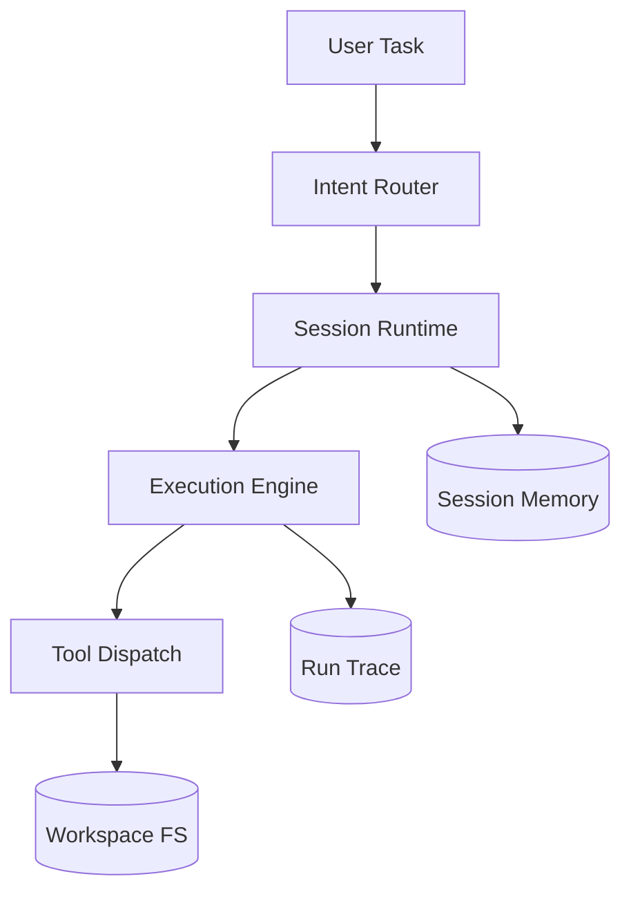

# Telvyn - Local-First Agent Runtime

> A local-first technical agent runtime designed for traceable execution, deterministic workspace reads, and session continuity.

---

## Why This Project Matters

Telvyn addresses a common reliability gap in agent workflows: non-deterministic I/O behavior and weak continuity between runs.

The architecture separates planning from filesystem truth, enforcing deterministic contracts for workspace reads while preserving session-level context across executions.

---

## System Architecture

---

## Core Runtime Model

### Conversation -> Session -> Run

- **Conversation**: logical grouping and recency metadata.
- **Session**: mutable continuity state (workspace, pending actions, bounded memory).
- **Run**: immutable trace of one execution.

### Continuity Behavior

- Carries forward bounded context from previous runs.
- Stores compact goals/facts/recent-actions memory deltas.
- Handles explicit confirm/cancel flows through persisted pending actions.

---

## Deterministic Workspace I/O Contract

A key architectural decision is strict deterministic handling for workspace-read intent:

- No model-in-the-loop for filesystem read outcomes.
- In-workspace path resolution only.
- Fixed retry budget.
- Deterministic search/list/existence behavior.
- Guardrails against path traversal and out-of-scope access.

This improves reliability, reproducibility, and safety for technical workflows.

---

## Tech Stack

- **Language**: Python
- **Interfaces**: CLI + Textual TUI
- **Execution**: local-first runtime
- **Backends**: Ollama and OpenAI-compatible providers
- **Testing**: unittest suite for runtime and contract paths

---

## Design Highlights

- Local-first execution model without mandatory cloud dependency.
- Scope-safe workspace operations.
- Clear separation between mutable session state and immutable run traces.
- Structured memory with bounded growth and continuity rules.
- Contract-driven deterministic I/O for read paths.

---

## References

- Runtime architecture: https://github.com/Angeles-HO/Telvyn/blob/main/docs/ARCHITECTURE.md
- Session model: https://github.com/Angeles-HO/Telvyn/blob/main/docs/CONVERSATION_SESSION_RUNTIME_MODEL.md
- Deterministic I/O contract: https://github.com/Angeles-HO/Telvyn/blob/main/docs/DETERMINISTIC_WORKSPACE_IO_CONTRACT.md
- Memory model: https://github.com/Angeles-HO/Telvyn/blob/main/docs/MEMORY_MODEL.md

---

## Portfolio Note

This document summarizes architecture decisions and technical boundaries for portfolio and interview discussion. It does not expose internal private implementation details beyond already-public repository documentation.
